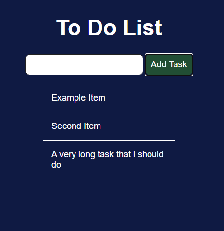

# To Do App with Redux

Project created to practice the basic concepts of Redux with ReactJS.

It consist in a simple input field to add new tasks in a list.

 

Project created with ReactJS, Redux and styled-components.

Based in classes of a bootcamp at Digital Innovation One
